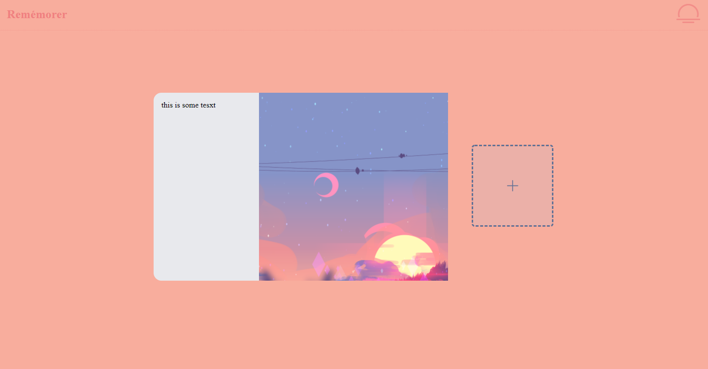

#### Shopify Challenge for the Backend Developer Position (2020)

Candidate: Clara Chick (https://clarachick.me/)

#### Dependencies and Technologies:

- node (v15.4.0)
- npm (v7.0.15)

- MongoDB

Install before use: `npm i mongoose mongoose-gridfs gridfs-stream multer express node dotenv cors`

**The Task**: build an image repository. 

#### **Solution**:

Because this was an open ended task, I decided to get started on an idea I've had for a while: Remémorer.

The goal of this project is to create a full-stack app to allow users to upload happy memories and accomplishments and reminisce whenever they are feeling a bit down or just a bit lost.

Since this is a backend position, I will only be showcasing the backend for this project.

The two ideas I chose were:

ADD and  DELETE image(s).

#### Usage:

All successful returns will have status of `200`. Else status would be `400` with various error messages.

Use with [Insomnia](https://insomnia.rest/) or [Postman](https://www.postman.com/).

#### Endpoints:

1. account management

   a. creating an account

**Endpoint:** 

##### `POST` `http://localhost:7000/api/user/signup/`

JSON Body:

```json
{
    "username": "some unique username",
    "password": "some password"
}
```

**Returns**: `user._id` which should be used for all further requests 

> (to prevent a user from deleting images from another user)

<hr/>

​				b. logging into an existing account

**Endpoint:** 

##### `POST` `http://localhost:7000/api/user/login/`

JSON Body:

```json
{
    "username": "some username",
    "password": "some password"
}
```

**Returns**: `user._id` which should be used for all further requests 

> (to prevent a user from deleting images from another user)

<hr/>

2. upload some files

**Endpoint:** 

##### `POST` `http://localhost:7000/api/user/files/upload/`

Form Data:

```json
"_id": "_id you get from logging in or signing up"
"files": [{array of files}]
"desc": "description of the images"
```

**Returns**: `user.imgs` which is an array of image id's

**Sample Return**:  

```json
[
  "5ff3da0ed03546213c542625",
  "5ff3da4fd03546213c542627",
  "5ff3da68d03546213c54262a"
]
```

<hr/>

3. get some random `image _id` to reminisce about 

**Endpoint:** 

##### `GET` `http://localhost:7000/api/user/files/reminisce `

JSON Body:

```json
{
    "_id": "_id you get from logging in or signing up"
}
```

**Returns**: 

```json
{
    "image": "image id which is used to get the image",
    "desc": "description of the image"
}
```

**Sample Return**: 

```json
{
  "image": "5ff3da0ed03546213c542625",
  "desc": "stunning sunset"
}
```

<hr/>

4. get image (if you have access)

**Endpoint:** 

##### `GET` `http://localhost:7000/api/user/files/get/:imgId`

- `imgId`: `image _id`

JSON Body: 

```json
{
    "_id": "_id you get from logging in or signing up"
}
```

**Returns**: the image corresponding to `imgId`

> error: if image wasn't uploaded by _id

<hr/>

5. delete image (if you have access)

**Endpoint:** 

##### `DELETE` `http://localhost:7000/api/user/files/delete/:imgId`

- `imgId`: `image _id`

JSON Body: 

```json
{
    "_id": "_id you get from logging in or signing up"
}
```

**Returns**: the image corresponding to `imgId`

> error: if image wasn't uploaded by _id

<hr/>

6. delete account, and all files related to it

**Endpoint:** 

##### `DELETE` `http://localhost:7000/api/user/files/delete/account/:id`

- `id`: `_id you get from logging in or signing up`

**Returns**: Success or Failure

<hr/>

##### Add image(s) to the repository.

- [one / bulk / enormous amount of images](https://github.com/KohinaTheCat/Rememorer-Shopify-Backend-Developer-Challenge/blob/master/backend/routes/files.js#L57)

`upload.any()` - can upload any amount of files at once

- [private or public (permissions)](https://github.com/KohinaTheCat/Rememorer-Shopify-Backend-Developer-Challenge/blob/master/routes/user.js#L28)

(as a full-stack app) the user must login before they can access images attached to their account. As displayed in the link above, the password of the account is salted and hashed. 

- [secure uploading and stored images](https://github.com/KohinaTheCat/Rememorer-Shopify-Backend-Developer-Challenge/blob/master/.env)

For this challenge, I didn't add `.env` to the `.gitignore`, but typically the database URI is to be kept secret to ensure security. 

##### DELETE image(s)

- [one / bulk / selected / all images]()

When a user decides to delete their account, their images are deleted too.

You can delete individual files for an account.

- Prevent a user deleting images from another user (access control)

(as a full-stack app) the user is meant to login

(as an API) add password verification (see [here](https://github.com/KohinaTheCat/Rememorer-Shopify-Backend-Developer-Challenge/blob/master/routes/user.js#L28))

- secure deletion of images

I trust Mongo :heart:

<hr/>

:sob:


